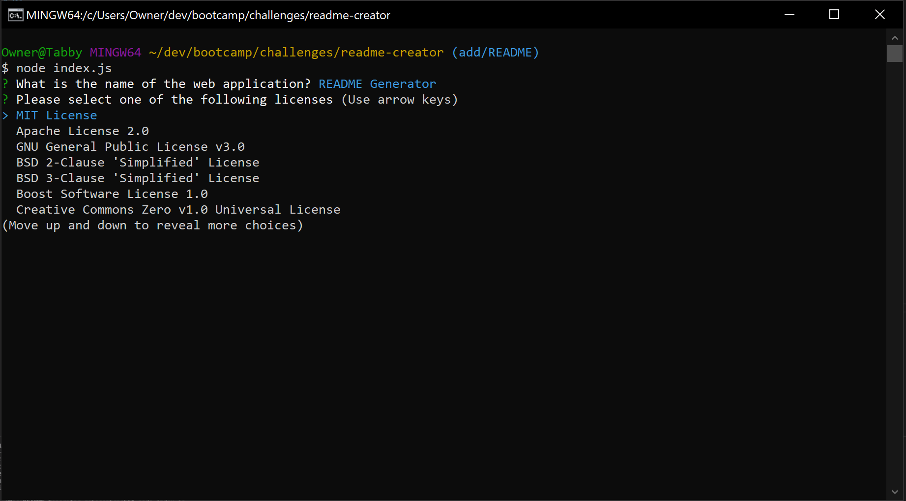

# README Generator

## Description

This application is a README generator designed to streamline making a README for individuals who use this application. It gives you a set of prompts that are used to generate the README for the application you are working on. This project shows my ability to use node.js as well as the use of promises and higher level JavaScript.

## Table of Contents
 - [Usage](#usage)
 - [Credits](#credits)
 - [License](#license)
 - [Questions](#questions)

## Usage

https://drive.google.com/file/d/17SjvhNPR327H4LeZPdiXLbd2P2dZiKmL/view
<!-- <iframe src="https://drive.google.com/file/d/17SjvhNPR327H4LeZPdiXLbd2P2dZiKmL/preview" width="640" height="480"></iframe> -->
<!-- <video align="center" controls><source src="./assets/videos/how-to-use-readme-generator.webm" type="video/webm" alt="How to use README generator"></video>
 -->

To use the application, open a CLI and 'cd' into the directory containing the index.js. Once you are in the directory, type in 'node index.js' into the CLI and follow the prompts it gives you. Once you complete the prompts, the application will generate a README in the directory you used it in.

## Credits

Creator: Gustavo Carrillo 
Credits to sheild.io for the tags used for the licenses

## License

This project is under the MIT License

## Questions
     
If you have any questions about my application, please contact me through the following:

 - [GitHub Profile](https://github.com/0zrk23)
 - [Email](gus.carrillo1221@gmail.com)